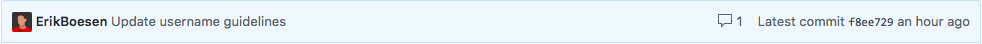

# 1418 Programming Guidelines

## Code
* Use detailed comments and docstrings in all code, written in proper English. Anyone on the team with even slight knowledge of the language the code is written in, should be able to read your comments and have a good understanding of what the code does and why.
* Always follow style guides. For example, the Python [PEP 8 Style Guide](https://www.python.org/dev/peps/pep-0008).
    * For web languages (HTML/CSS/JS), follow the [Viget FED Best Practices](https://github.com/greypants/FED-docs/blob/master/Best-Practices.md).

## Committing
* All commit names must be in easily legible English. You don't have to use full sentences, but the names should be clear, concise, easy to understand, and PG.

    **Good:**
    
    

    **Bad:**
    
    

    **Even worse:**
    
    

* Never commit directly to origin (the repository owned by the team GitHub). Instead:
    1. Fork the repository to your personal GitHub account.
    2. Perform your changes on that fork.
    3. Open a pull request to merge your changes to the master branch.
    4. Wait for approval from another team member.
* Only commit through your own GitHub account. No using dummy accounts.
* Use .gitignore files to prevent committing of useless temporary folders and files like `.DS_Store`, `.project`, `.pydevproject`, and others. [Help with `.gitignore` files](https://help.github.com/articles/ignoring-files)

## READMEs
* All repositories should have a `README.md` file explaining their purpose, how they were used, and how to use them. (They don't need to be added until the code is publicized at the end of each season.)
* At the top of each README, a set of links should be present linking to the other repositories used that season.

An example of a good README can be found [here](https://github.com/frc1418/2016-robot/blob/master/README.md).