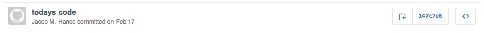

# 1418 Github Guildlines

## Profiles
* Use the portrait of yourself from [the Team Profiles page](http://1418.team/team) on our website as your GitHub user picture. Photos can be found by locating them on that page, or by visiting http://1418.team/assets/img/team/firstname-lastname.png.
* Your username must be in the format FirstLast if it's available. In the event that the name is already taken, you can try switching between a full name and a nickname, or using an initial rather than a full name, or combining your first and last names into one word. For example, "Jack Smith" could become "jamith," as long as the username is clearly representative of your real name and doesn't include other characters.
* Your account name must be your real name.

* When setting up Git for the first time, you must run the following two commands:

    git config --global user.name "YourUserName"
    git config --global user.email your@email.com

This will allow GitHub to recognize your commits as tied to your own account.

* It's also highly recommended, though not required, that you [securely sign your commits](https://github.com/pstadler/keybase-gpg-github#readme).

## Setting up your repo
Start off by creating a fork of the repo you will be working on. Don't clone it directly. This allows you to create Pull Requests, which are ways of allowing your code to be peer reviewed before merging it with the master branch.

Now, clone from your fork rather than the upstream repository.

You can now push code to your branch, but in order to keep up with the team master branch, you'll need to add a *remote* that links to the team master branch. To add a remote:

    git remote add upstream git://github.com/frc1418/repo

You can then easily pull changes from the upstream repository:

    git fetch upstream
    git checkout master
    git merge upstream/master

When you make changes, run

    git checkout -b branch-name

Replacing `branch-name` with a one to three word summary of your changes. For example, `fix-arm` or `add-gimbal`. Then, push to that branch and make pull requests from there, rather than from your master branch.

Never, ever, EVER commit to the `master` branch on either your fork or the upstream repository.

## Commiting
All commit names must be coherent explanations of the commit, written in legible English, **in the imperative**. The imperative is the verbal form used when giving a command. For example, do **not** name your commit

    Added CenterGear autonomous

Instead, use

    Add CenterGear autonomous

As rule of thumb, your commit title should complete the sentence "If applied, this commit will..."

You don't have to use full sentences, but the names should be clear, concise, and PG.

**Good:**


**Bad:**


**Even worse:**




* Only commit through your own GitHub account. No using dummy accounts.
    * Relatedly, your GitHub account should have your real name on it so we can tell who's who. Refer to the naming guidelines at the starting of this guide for more information.
* Use `.gitignore` files to prevent committing of useless temporary folders and files like `.DS_Store`, `.project`, `.pydevproject`, `node_modules`, `.deploy_cfg` and others. [Help with .gitignore files](https://help.github.com/articles/ignoring-files)

## Rebasing
Sometimes when you make a pull request there a some changes that need to be made to make the feature complete. This is normal, as you may not always think of everything from the get go, but it does create a problem. Every time you commit and update the feature it will be added to the commit history. This is generally not what you want. For example, let's say you create `drive.py`, but accidently leave out an important line of code. You could have two commits: `Add drive.py` and `Add line of code`, but it would make sense and look better for it to all be under `Add drive.py`. To merge these, we use `git rebase`.

Rebasing is a way of rewriting git history. There are some more advanced things you can do with it but for now we're going to talk about squashing commits.

Once you have commited your code *but not pushed*, run `git rebase -i HEAD~n` where n is the number of commits ago you want to squash. Generally, n will be 2, because you'll make the first commit, realize you left something, make another commit, and squash. But let's say you commit, remember another thing, and commit again. Now your history looks like

```
$ git log --pretty=oneline
a931ac7c808e2471b22b5bd20f0cad046b1c5d0d addition 2
b76d157d507e819d7511132bdb5a80dd421d854f addition 1
df239176e1a2ffac927d8b496ea00d5488481db5 original
```
We want to squash the last 3 together, so we run `git rebase -i HEAD~3` and you get this:

```
pick df23917 original
pick b76d157 addition 1
pick a931ac7 addition 2

# Rebase df23917..a931ac7 onto df23917
#
# Commands:
#  p, pick = use commit
#  r, reword = use commit, but edit the commit message
#  e, edit = use commit, but stop for amending
#  s, squash = use commit, but meld into previous commit
#  f, fixup = like "squash", but discard this commit's log message
#
# If you remove a line here THAT COMMIT WILL BE LOST.
# However, if you remove everything, the rebase will be aborted.
#
```

This is the interactive rebaser. At the top, you'll see the log of commits you're working with. To the left of each commit will be `pick`. To rebase, find the commit you want to be the one and only commit. Leave this as `pick`. Change the other `pick`s to `s` or `squash` (the both do the same thing). It should look like:

```
pick df23917 original
s b76d157 addition 1
s a931ac7 addition 2


# Rebase df23917..a931ac7 onto df23917
#
# Commands:
#  p, pick = use commit
#  r, reword = use commit, but edit the commit message
#  e, edit = use commit, but stop for amending
#  s, squash = use commit, but meld into previous commit
#  f, fixup = like "squash", but discard this commit's log message
#
# If you remove a line here THAT COMMIT WILL BE LOST.
# However, if you remove everything, the rebase will be aborted.
#
```
Once you do that, save and exit (to save and exit `vim`, the default git text editor, press `Esc` then type `:wq` and press Enter). You will be greeted by another screen.

```
# This is a combination of 3 commits.
# The first commit's message is:

original

# This is the 2nd commit message:

addition 1

# This is the 3rd commit message:

addition 2
```

Now you have a choice of what you want the commit message to look like. You can comment out the new commit messages and only have one, or keep all 3. It's probably not necessary to keep all three, so add a `#` before `additon 1` and `addition 2`.

Now you're ready to push. This will be a special push because we need to force it, so we will use the `+` operator.

`git push origin +branch`

And now your PR will show 1 commit, with all the changes.
